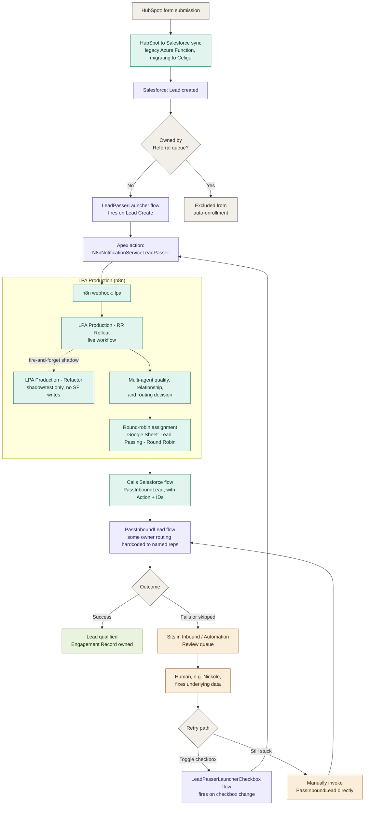

# Lead Passing Flow Diagram

A single end-to-end view of how a Lead moves from HubSpot through to a Qualified Engagement
Record (or a manual save). This is a Mermaid diagram — GitHub renders it natively in both
regular markdown files and the wiki, no export needed.

For the detail behind each node, see the linked pages: `Legacy-HS2SF-Function-App`,
`Celigo-HubSpot-to-Salesforce-Sync`, `LPA-Trigger-Flows`, `LPA-Overview`,
`PassInboundLead-Flow`, `Manual-Lead-Passing-Process`.

**Reading the colors:** purple = Salesforce-native (Leads, Flows, the Apex action); teal =
the automation/integration layer (the sync app and n8n); amber = a human doing manual work;
green = the successful outcome; gray = decision points and the start/excluded states.

**Two things this diagram simplifies, spelled out in prose:**
- The "still stuck" manual retry path assumes the person working the queue has already done
  the account/contact cleanup described in `Manual-Lead-Passing-Process` — the diagram shows
  the retry mechanics, not that underlying data-fixing work.
- `PassInboundLead`'s hardcoded named-rep routing (see `PassInboundLead-Flow`) isn't broken out
  as its own branch here — it's a property of the single "PassInboundLead flow" node, not a
  separate path a Lead takes.
